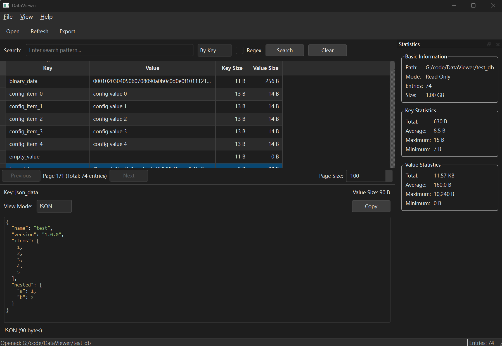

# DataViewer

A cross-platform database viewer application for viewing and managing database contents. Initially supports LMDB (Lightning Memory-Mapped Database).


## Features

- **Database Management**
  - Open LMDB databases in read-only or read-write mode
  - Database history tracking (recent databases)
  - Quick reconnect to recent databases

- **Data Browsing**
  - Table view for key-value pairs
  - Pagination for large datasets
  - Search with regex support (by key or value)

- **Data Viewing**
  - Multiple view modes:
    - Text (UTF-8/ASCII)
    - Hexadecimal
    - JSON (with syntax highlighting)
    - MessagePack (auto-detection)
  - Copy data to clipboard
  - Data size and statistics display

- **Data Export**
  - Export to JSON, CSV, or TXT formats
  - Export selected items or all data

- **Statistics Panel**
  - Entry count and database size
  - Key/value size statistics (min/max/average)

## Installation

### From Source

1. Clone the repository:
   ```bash
   git clone https://github.com/magic-zhu/DataViewer.git
   cd DataViewer
   ```

2. Create a virtual environment (recommended):
   ```bash
   python -m venv venv
   
   # Windows
   venv\Scripts\activate
   
   # Linux/macOS
   source venv/bin/activate
   ```

3. Install dependencies:
   ```bash
   pip install -r requirements.txt
   ```

4. Run the application:
   ```bash
   python main.py
   ```

### From Release (Windows)

Download the latest `DataViewer.exe` from the [Releases](https://github.com/yourusername/DataViewer/releases) page.

## Usage

### Opening a Database

1. Click **File** > **Open Database** or press `Ctrl+O`
2. Select the LMDB database directory (the folder containing `data.mdb` and `lock.mdb`)
3. Choose read-only or read-write mode

### Browsing Data

- Use the table view to browse all key-value pairs
- Click on a row to view the full content in the detail panel
- Use the pagination controls at the bottom to navigate large datasets

### Searching

1. Enter your search term in the search box
2. Choose search type:
   - **Key**: Search in key names
   - **Value**: Search in value content
3. Enable **Regex** for regular expression search
4. Press Enter or click Search

### Viewing Data

Switch between view modes in the detail panel:
- **Text**: View as decoded text
- **Hex**: View as hexadecimal dump
- **JSON**: View as formatted JSON with syntax highlighting
- **MsgPack**: Parse and view MessagePack data

### Exporting Data

1. Select items in the table (use Ctrl/Shift for multiple selection)
2. Click **File** > **Export** > **Export Selected** or **Export All**
3. Choose the export format (JSON, CSV, TXT)
4. Select the output file location

## Development

### Project Structure

```
DataViewer/
├── main.py              # Application entry point
├── build.py             # Build script
├── requirements.txt     # Dependencies
├── dataviewer.spec      # PyInstaller spec file
├── core/                # Core database abstraction
│   ├── base.py          # Database adapter interface
│   ├── lmdb_adapter.py  # LMDB implementation
│   └── utils.py         # Utility functions
├── ui/                  # User interface
│   ├── main_window.py   # Main application window
│   ├── database_view.py # Table view widget
│   ├── data_viewer.py   # Data detail viewer
│   ├── search_panel.py  # Search panel
│   ├── stats_panel.py   # Statistics panel
│   └── styles.py        # Dark theme stylesheets
├── models/              # Data models
│   └── database_model.py # Qt table model
├── utils/               # Utility modules
│   └── export.py        # Data export functionality
├── config/              # Configuration
│   └── history.py       # Database history management
└── tests/               # Test suite
    ├── test_base.py
    ├── test_lmdb_adapter.py
    ├── test_utils.py
    └── ...
```

### Running Tests

```bash
pytest tests/ -v
```

### Building

Build for current platform:

```bash
# Standard build
python build.py

# Build with console window (for debugging)
python build.py --debug

# Clean and rebuild
python build.py --clean
```

The built executable will be in the `dist/` directory.

## Requirements

- Python 3.10+
- PyQt6 >= 6.4.0
- lmdb >= 1.4.1
- msgpack >= 0.6.0
- pyperclip >= 1.8.0 (optional, for clipboard support)

## License

MIT License

## Contributing

1. Fork the repository
2. Create a feature branch (`git checkout -b feature/amazing-feature`)
3. Commit your changes (`git commit -m 'feat: add amazing feature'`)
4. Push to the branch (`git push origin feature/amazing-feature`)
5. Open a Pull Request

## Roadmap

- [ ] Phase 3: Edit functionality (read-write mode, value editor)
- [ ] Phase 4: Data visualization, backup/restore
- [ ] Support for SQLite, LevelDB, RocksDB
- [ ] Plugin system for custom data formats
- [ ] Dark/Light theme switching

## Changelog

### v0.1.0 (Current)
- Basic LMDB support
- Key-value browsing with pagination
- Multiple view modes (Text, Hex, JSON, MsgPack)
- JSON syntax highlighting
- Search with regex support
- Data export (JSON, CSV, TXT)
- Database history
- Statistics panel
